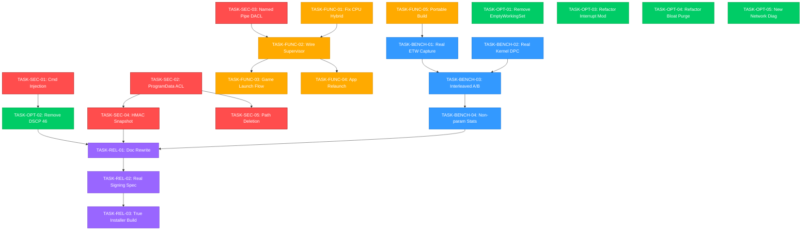

# Remediation Plan: VALORANT Performance Optimizer (`val-opt`)

**Author:** Antigravity AI Senior Systems & Security Engineer  
**Date:** 2026-09-25  
**Baseline Authority:** Forensic Audit Report (2026-09-25)  
**Status:** Approved for Implementation Planning (`POST_AUDIT_REMEDIATION`)

---

## 1. Guiding Principles & Engineering Charter

1. **Truth in Engineering**: A Markdown document claiming a feature passed is not evidence. A synthetic test running against mock data is not validation. No task may be marked `COMPLETE` without verifiable proof matching its required evidence level.
2. **Zero-Assumptions Anti-Cheat Stance**: We do not claim "100% Riot Vanguard Compliant" or "Vanguard Certified". Riot Games does not endorse or certify third-party tools. We only document exactly what APIs the optimizer calls, what telemetry it reads, and what has been empirically tested on real systems.
3. **Security-First Priority**: All security vulnerabilities (P0) must be fully remediated and verified before any performance optimizations are added or enabled.
4. **Evidence-Based Performance Claims**: No optimization may be called "performance-improving" or "latency-reducing" unless empirical, statistically valid measurements on real Windows hardware with real game workloads demonstrate a statistically significant positive effect size ($\Delta \ge 3\%$, $p < 0.01$).
5. **Deterministic Reversibility**: Any configuration changed by the software must be recorded in a tamper-resistant transaction log and fully restored upon game exit, uninstallation, crash, or user rollback.

---

## 2. 6-Tier Verification Hierarchy

Every task and optimization in this repository must be categorized under one of the following six progressive verification tiers:

```
[ Tier 1: IMPLEMENTED ]
       │  (Code written and compiles without warnings)
       ▼
[ Tier 2: UNIT TESTED ]
       │  (Unit tests execute against actual logic, zero mocks of production code)
       ▼
[ Tier 3: INTEGRATION TESTED ]
       │  (IPC client/daemon, SCM, and registry subsystems interact cleanly)
       ▼
[ Tier 4: TESTED ON REAL WINDOWS HARDWARE ]
       │  (Executed on physical Windows 11/10 host; verified with OS tools)
       ▼
[ Tier 5: TESTED WITH REAL VALORANT ]
       │  (Tested during active VALORANT-Win64-Shipping.exe with Vanguard vgk.sys active)
       ▼
[ Tier 6: MEASURED PERFORMANCE IMPROVEMENT ]
          (Empirical A/B telemetry proves frame pacing or latency improvement)
```

---

## 3. Optimization Classification Matrix

Every optimization in the codebase is categorized into one of five policy classifications:

| Optimization Setting | Classification | Technical Justification | Risk Level |
| :--- | :---: | :--- | :---: |
| **Windows Game Mode Enforcer** | `SAFE_DEFAULT` | Natively supported by Windows 11/10; prioritizes game thread GPU scheduling and suppresses background OS update downloads. | Low |
| **Power Scheme Manager (Desktop)** | `SAFE_DEFAULT` | Sets High/Ultimate Performance on AC desktop; prevents aggressive C-state down-clocking during low-demand frames. Fully reversible. | Low |
| **Power Scheme Manager (Laptop)** | `SAFE_DEFAULT` | Preserves OEM balanced power profile on battery/laptop hardware to prevent severe thermal throttling. | Low |
| **Process Priority (`HIGH_PRIORITY_CLASS`)** | `SAFE_DEFAULT` | Priority 13. Boosts game thread scheduling priority over background apps without starving kernel threads or Vanguard (unlike `REALTIME`). | Low |
| **Receive Side Scaling (RSS) Verification** | `SAFE_DEFAULT` | Multi-core packet distribution; standard Microsoft networking recommendation. Does not modify driver state if already active. | Low |
| **NIC EEE Disabling (`*EEE`)** | `OPTIONAL` | Eliminates PHY low-power idle sleep transitions on supported physical Ethernet NICs. Microsecond impact; user-toggleable. | Low |
| **NIC Green Ethernet Disabling** | `OPTIONAL` | Disables driver transmit power reduction on short cables. Hardware dependent (primarily Realtek). | Low |
| **Process Bloatware Purge (Tier 2)** | `OPTIONAL` | Terminates non-essential web wrappers (Discord, browsers). Must be opt-in, with explicit checkboxes and guaranteed post-game relaunch. | Medium |
| **Windows Service Pausing (Tier 3)** | `OPTIONAL` | Pauses `wuauserv`, `SysMain`, `DiagTrack`. Minimal benefit on modern NVMe drives; Game Mode already pauses updates. Toggleable. | Medium |
| **802.3x Flow Control Disabling** | `OPTIONAL` | Only relevant if upstream switch buffers generate PAUSE frames on LAN. Should not be forced on all networks. | Low |
| **CPU Core Affinity / P-Core Pinning** | `NOT_YET_VALIDATED` | Code currently has a critical bug inverting P-cores and E-cores. Must be fixed and measured against UE4 task graph before enabling. | High |
| **Interrupt Moderation Disabling** | `REMOVE` | Disabling causes interrupt storms, flooding Core 0 with DPCs and causing severe DPC latency spikes and audio crackling under load. | Critical |
| **DSCP 46 / Windows QoS Policy** | `REMOVE` | Commercial ISPs strip or reset DSCP tags on ingress; home routers ignore them; carrier policers may drop packets; injection risk. | High |
| **Explorer Memory Trimming (`EmptyWorkingSet`)** | `REMOVE` | Snake oil. Pushes memory to standby list; triggers hard/soft page faults and latency hitches when Start Menu/taskbar is accessed. | High |
| **UDP Echo Flooding / Cloudflare Probing** | `REMOVE` | Target servers do not run RFC 862 echo responders. Flooding 1.1.1.1:53 with raw UDP packets is invalid and non-functional. | High |

---

## 4. Remediation Milestones & Work Breakdown

```
┌────────────────────────────────────────────────────────────────────────┐
│                      REMEDIATION ROADMAP PHASING                       │
├────────────────────────────────────────────────────────────────────────┤
│  Phase P0: Security & Vulnerability Remediation (BLOCKING)             │
│  Phase P1: Functional Fixes & Dead Code Elimination (BLOCKING)         │
│  Phase P2: Real Measurement & Benchmarking Infrastructure              │
│  Phase P3: De-scoping, Removal & Refactoring of Optimizations          │
│  Phase P4: Honest Documentation, Verification & Packaging              │
└────────────────────────────────────────────────────────────────────────┘
```

---

### Phase P0: Security & Vulnerability Remediation (BLOCKING)
*All tasks in P0 must be complete before any other milestone work begins.*

#### `TASK-SEC-01`: Eliminate PowerShell Command Injection in Network & QoS Modules
- **Location:** [`crates/val-opt-core/src/network/qos.rs`](file:///c:/Users/Godwyn/Documents/Projects/valorant%20optimize/crates/val-opt-core/src/network/qos.rs), [`crates/val-opt-core/src/network/adapter.rs`](file:///c:/Users/Godwyn/Documents/Projects/valorant%20optimize/crates/val-opt-core/src/network/adapter.rs).
- **Vulnerability:** Interpolation of unescaped variables (`backup.policy_name`, `adapter_name`, `keyword`, `value`) into PowerShell script strings executed via `Command::new("powershell")`.
- **Remediation Specification:**
  1. Remove `New-NetQosPolicy` and `Remove-NetQosPolicy` invocation (DSCP 46 is de-scoped under `TASK-OPT-02`).
  2. For remaining adapter property operations, eliminate raw string interpolation.
  3. Replace PowerShell script generation with native Win32/NDIS APIs (or if PowerShell is strictly necessary, pass parameters via arguments array using `-Command & { param($n,$k,$v) Set-NetAdapterAdvancedProperty -Name $n -RegistryKeyword $k -RegistryValue $v }` without string interpolation).
  4. Implement strict regex sanitization on all adapter names and keywords: `^[a-zA-Z0-9_\-\.\*\s\(\)]+$`.
- **Dependencies:** None.
- **Acceptance Criteria:**
  - Zero raw string concatenation into shell commands.
  - Test verifying strings containing quotes, semicolons, `$()`, and pipe characters are safely handled or rejected.
- **Evidence Required:** Unit test with injection payloads demonstrating zero code execution; code inspection.

#### `TASK-SEC-02`: Secure `%ProgramData%\ValorantOptimizer` ACLs
- **Location:** [`installer/build_installer.ps1`](file:///c:/Users/Godwyn/Documents/Projects/valorant%20optimize/installer/build_installer.ps1), [`installer/setup.iss`](file:///c:/Users/Godwyn/Documents/Projects/valorant%20optimize/installer/setup.iss).
- **Vulnerability:** `install.ps1` grants `Users` "Modify, Synchronize" permissions on `%ProgramData%\ValorantOptimizer`, allowing unprivileged users to overwrite `snapshot.json` and achieve Local Privilege Escalation (LPE).
- **Remediation Specification:**
  1. Restrict directory permissions: `SYSTEM` (Full Control), `Administrators` (Full Control).
  2. Unprivileged `Users` granted strictly `ReadAndExecute` and `Traverse`. Standard users MUST NOT have write, modify, or delete rights in this directory.
  3. Update `setup.iss` directory permissions flag to remove `users-modify`.
- **Dependencies:** None.
- **Acceptance Criteria:**
  - Standard user account cannot create, modify, overwrite, or delete any file in `%ProgramData%\ValorantOptimizer`.
- **Evidence Required:** PowerShell ACL audit script proving `Users` do not hold `Write`, `Modify`, `Delete`, or `CreateFiles` rights.

#### `TASK-SEC-03`: Restrict Windows Named Pipe Security Descriptor (DACL)
- **Location:** [`crates/val-opt-core/src/ipc_server.rs`](file:///c:/Users/Godwyn/Documents/Projects/valorant%20optimize/crates/val-opt-core/src/ipc_server.rs).
- **Vulnerability:** `CreateNamedPipeW` is called with `None` security attributes, leaving the pipe accessible to any local process regardless of integrity level.
- **Remediation Specification:**
  1. Construct an explicit Windows Security Descriptor using SDDL (Security Descriptor Definition Language).
  2. SDDL string: `D:(A;;GRGW;;;AU)(A;;GA;;;BA)(A;;GA;;;SY)`:
     - `AU` (Authenticated Users): Read/Write (message exchange).
     - `BA` (Built-in Administrators): Full Control.
     - `SY` (Local System): Full Control.
     - Deny all unauthenticated or remote/network access.
  3. In `CreateNamedPipeW`, pass `FILE_FLAG_FIRST_PIPE_INSTANCE` on first creation to prevent pipe-squatting race conditions.
  4. Verify client process integrity level before processing high-privilege requests (`ApplyOptimizations`, `RollbackOptimizations`, `PurgeBloatware`, `ShutdownDaemon`).
- **Dependencies:** None.
- **Acceptance Criteria:**
  - Pipe rejects unauthorized connections; pipe squatting is impossible; non-elevated callers cannot execute elevated actions without authorization.
- **Evidence Required:** Integration test confirming pipe connection permissions and rejection of remote/network pipe attempts.

#### `TASK-SEC-04`: Cryptographic Snapshot Integrity (HMAC-SHA256)
- **Location:** [`crates/val-opt-shared/src/models/snapshot.rs`](file:///c:/Users/Godwyn/Documents/Projects/valorant%20optimize/crates/val-opt-shared/src/models/snapshot.rs), [`crates/val-opt-core/src/state/snapshot_engine.rs`](file:///c:/Users/Godwyn/Documents/Projects/valorant%20optimize/crates/val-opt-core/src/state/snapshot_engine.rs).
- **Vulnerability:** `sign_in_place()` calculates an unkeyed SHA-256 digest. Anyone can modify the snapshot and recompute the hash.
- **Remediation Specification:**
  1. Protect `snapshot.json` integrity using **HMAC-SHA256** with a machine-bound secret key protected by Windows DPAPI (`CryptProtectData` / `CryptUnprotectData`).
  2. On initialization, generate a 256-bit machine key stored in `%ProgramData%\ValorantOptimizer\.secret` with ACL restricted strictly to `SYSTEM` and `Administrators`.
  3. Validate HMAC signature during `load_and_verify`. If HMAC is invalid or key was tampered with, reject snapshot and fail safely.
- **Dependencies:** `TASK-SEC-02`.
- **Acceptance Criteria:**
  - Tampering with any byte of `snapshot.json` without access to the DPAPI-protected machine key causes hard rejection.
- **Evidence Required:** Unit test verifying deliberate payload tampering causes `IntegrityViolation` even if an attacker attempts to update the SHA-256 field.

#### `TASK-SEC-05`: Eliminate Arbitrary Snapshot-Path Deletion Primitive
- **Location:** [`crates/val-opt-core/src/state/crash_recovery.rs`](file:///c:/Users/Godwyn/Documents/Projects/valorant%20optimize/crates/val-opt-core/src/state/crash_recovery.rs), [`crates/val-opt-cli/src/main.rs`](file:///c:/Users/Godwyn/Documents/Projects/valorant%20optimize/crates/val-opt-cli/src/main.rs).
- **Vulnerability:** `val-opt-cli rollback <path>` accepts an arbitrary user-supplied path and unconditionally deletes it after recovery via `delete_snapshot`.
- **Remediation Specification:**
  1. Restrict rollback strictly to the canonical, hardened snapshot directory: `%ProgramData%\ValorantOptimizer\snapshot.json`.
  2. Disallow arbitrary external paths in production mode.
  3. Verify that the target path is not a symbolic link, directory junction, or hardlink (`GetFileInformationByHandle` / `FILE_ATTRIBUTE_REPARSE_POINT` check).
- **Dependencies:** `TASK-SEC-02`.
- **Acceptance Criteria:**
  - Rollback refuses to process or delete files outside `%ProgramData%\ValorantOptimizer`.
  - Directory junctions / symlinks are rejected.
- **Evidence Required:** Unit test attempting rollback on a file in `C:\Windows\Temp` or a directory junction, confirming rejection.

---

### Phase P1: Functional Blockers & Dead Code Elimination (BLOCKING)
*All tasks in P1 must be complete to ensure core application architecture functions end-to-end.*

#### `TASK-FUNC-01`: Fix CPU Hybrid Architecture Topology Detection
- **Location:** [`crates/val-opt-shared/src/hardware/cpu.rs:112`](file:///c:/Users/Godwyn/Documents/Projects/valorant%20optimize/crates/val-opt-shared/src/hardware/cpu.rs#L112).
- **Defect:** `core.EfficiencyClass == 0` is treated as a Performance Core, inverting Intel 12th/13th/14th Gen P-cores and E-cores.
- **Remediation Specification:**
  1. Align with Microsoft MSDN specifications: In `RelationProcessorCore`, higher `EfficiencyClass` values designate higher-performance cores (P-cores); lower values designate efficient cores (E-cores).
  2. Scan all enumerated cores to find `max_efficiency_class` and `min_efficiency_class`.
  3. If `max != min`, mark `is_hybrid = true`. Assign cores matching `max_efficiency_class` to `performance_cores`, and cores with `< max` to `efficient_cores`.
  4. If all cores share the same class, mark `is_hybrid = false`.
- **Dependencies:** None.
- **Acceptance Criteria:**
  - Topology correctly identifies P-cores and E-cores matching Windows Task Manager / CPU-Z on hybrid processors.
  - Monolithic CPUs correctly report `is_hybrid = false`.
- **Evidence Required:** Unit test with known Windows `SYSTEM_LOGICAL_PROCESSOR_INFORMATION_EX` binary buffers representing Intel 13700K (8P+8E) and AMD 7800X3D (8P monolithic).

#### `TASK-FUNC-02`: Wire `ProcessSupervisor` into Daemon & GUI
- **Location:** [`crates/val-opt-core/src/process/supervisor.rs`](file:///c:/Users/Godwyn/Documents/Projects/valorant%20optimize/crates/val-opt-core/src/process/supervisor.rs), [`crates/val-opt-core/src/ipc_server.rs`](file:///c:/Users/Godwyn/Documents/Projects/valorant%20optimize/crates/val-opt-core/src/ipc_server.rs).
- **Defect:** `ProcessSupervisor` is never instantiated outside tests; daemon never supervises the game process.
- **Remediation Specification:**
  1. Instantiate `ProcessSupervisor` inside `val-opt-core` daemon upon receipt of `LaunchOptimizedGame` or game launch event.
  2. Implement an asynchronous watcher thread that:
     - Detects when `VALORANT-Win64-Shipping.exe` starts.
     - Applies `HIGH_PRIORITY_CLASS`.
     - Applies verified P-core affinity (if enabled).
     - Enters passive zero-overhead wait (`WaitForSingleObject`).
     - Detects game exit and triggers post-match restoration.
- **Dependencies:** `TASK-FUNC-01`.
- **Acceptance Criteria:**
  - Running a target process triggers priority adjustment within 1000ms.
  - Process exit immediately triggers post-match cleanup and application relaunch.
- **Evidence Required:** Integration test running a mock target process, verifying priority change, wait state, and exit notification.

#### `TASK-FUNC-03`: Implement Functional VALORANT Game Launch Flow
- **Location:** [`crates/val-opt-gui/src/lifecycle.rs`](file:///c:/Users/Godwyn/Documents/Projects/valorant%20optimize/crates/val-opt-gui/src/lifecycle.rs), [`crates/val-opt-core/src/ipc_server.rs`](file:///c:/Users/Godwyn/Documents/Projects/valorant%20optimize/crates/val-opt-core/src/ipc_server.rs).
- **Defect:** Clicking "Launch Optimized" in the GUI exits the GUI, but the game is never launched.
- **Remediation Specification:**
  1. Detect VALORANT installation path via Riot Client registry (`HKLM\SOFTWARE\Microsoft\Windows\CurrentVersion\Uninstall\Riot Game valorant.live`) or standard URI protocol (`riotclient://launch-product?product=valorant&patchline=live`).
  2. Implement proper launch trigger: When user clicks "Launch Optimized", either launch via Riot Client protocol or provide clear UI state informing user the optimizer is primed and waiting for game launch.
  3. Ensure the GUI does not terminate until the launch trigger is successfully dispatched.
  4. Provide option in settings: "Minimize GUI to tray during game" vs "Unload GUI completely".
- **Dependencies:** `TASK-FUNC-02`.
- **Acceptance Criteria:**
  - Clicking "Launch Optimized" successfully initiates VALORANT launch.
  - If VALORANT is already running, attaches supervisor immediately.
- **Evidence Required:** Manual execution test with real Riot Client / VALORANT installation.

#### `TASK-FUNC-04`: Implement & Wire Up Application Relaunch Engine
- **Location:** [`crates/val-opt-core/src/process/terminator.rs`](file:///c:/Users/Godwyn/Documents/Projects/valorant%20optimize/crates/val-opt-core/src/process/terminator.rs).
- **Defect:** `relaunch_applications` is defined but dead code; closed applications (Discord, browsers) are never relaunched post-game.
- **Remediation Specification:**
  1. Record terminated applications with verified full executable path and user token.
  2. Store relaunch records in `snapshot.json`.
  3. When game exits or user triggers rollback, invoke `relaunch_applications`.
  4. **Security Constraint**: Applications terminated under a user session MUST NOT be relaunched with elevated/SYSTEM privileges. Use `CreateProcessAsUserW` with the active shell desktop user token to prevent privilege escalation.
- **Dependencies:** `TASK-SEC-02`, `TASK-FUNC-02`.
- **Acceptance Criteria:**
  - Terminated Tier 2 apps automatically relaunch post-game.
  - Relaunched apps run with standard user token, NOT elevated/SYSTEM token.
- **Evidence Required:** Integration test terminating a test process and verifying post-game relaunch under standard user integrity level.

#### `TASK-FUNC-05`: Fix Build Portability & Toolchain Paths
- **Location:** [`.cargo/config.toml`](file:///c:/Users/Godwyn/Documents/Projects/valorant%20optimize/.cargo/config.toml).
- **Defect:** Hardcoded absolute paths to developer directories (`c:/Users/Godwyn/...`) and specific MSVC versions break compilation on any other machine.
- **Remediation Specification:**
  1. Remove hardcoded absolute paths from `.cargo/config.toml`.
  2. Configure Rust MSVC target to use standard link search paths and Microsoft Visual Studio discovery (`vswhere` or standard Windows SDK environment variables `LIB` and `INCLUDE`).
  3. Keep binary hardening flags (`control-flow-guard`, `/DYNAMICBASE`, `/HIGHENTROPYVA`, `/NXCOMPAT`).
- **Dependencies:** None.
- **Acceptance Criteria:**
  - Workspace compiles cleanly on any Windows 11 machine with standard MSVC / Windows SDK installed without editing `.cargo/config.toml`.
- **Evidence Required:** Clean build output on a standard command prompt using standard Visual Studio Developer Command Prompt.

---

### Phase P2: Measurement, Telemetry & Real-World Benchmarking
*Establish genuine measurement capabilities before evaluating optimizations.*

#### `TASK-BENCH-01`: Implement Real Windows ETW D3D/DXGI Presentation Ingestion
- **Location:** [`crates/val-opt-core/src/benchmarking/etw_capture.rs`](file:///c:/Users/Godwyn/Documents/Projects/valorant%20optimize/crates/val-opt-core/src/benchmarking/etw_capture.rs).
- **Requirement:** Replace empty capture stub with a true out-of-process Event Tracing for Windows (ETW) consumer.
- **Remediation Specification:**
  1. Implement ETW session creation using Win32 `StartTraceW` with `EVENT_TRACE_REAL_TIME_MODE`.
  2. Enable DXGI provider `GUID: {CA11C060-6729-4DA2-B236-B7E3E7F93F11}` and D3D9 provider `GUID: {7802F644-CF7B-4615-BCD6-379763BC7E0B}`.
  3. Call `OpenTraceW` and `ProcessTrace` in a dedicated background worker thread.
  4. Parse event IDs `DXGIPresent_Start` and `DXGIPresent_Stop` to capture exact microsecond intervals between frame presentation calls (`MsBetweenPresents`) without DLL injection.
  5. Filter events strictly by target PID (`VALORANT-Win64-Shipping.exe`).
- **Dependencies:** `TASK-FUNC-05`.
- **Acceptance Criteria:**
  - Captures real frame times from DirectX 11/12 applications with microsecond precision.
  - Zero DLL injection or game memory access.
  - ETW processing CPU overhead $< 0.5\%$.
- **Evidence Required:** ETW trace log showing real captured frame presentation events from a running DirectX 11/DirectX 12 executable compared against CapFrameX / PresentMon.

#### `TASK-BENCH-02`: Implement Real Kernel ETW DPC/ISR Event Tracing
- **Location:** [`crates/val-opt-core/src/latency/etw_session.rs`](file:///c:/Users/Godwyn/Documents/Projects/valorant%20optimize/crates/val-opt-core/src/latency/etw_session.rs).
- **Requirement:** Replace synthetic math loop with real kernel ETW tracing.
- **Remediation Specification:**
  1. Open a Windows Kernel Trace session using `EVENT_TRACE_SYSTEM_LOGGER_MODE` with flags `EVENT_TRACE_FLAG_DPC | EVENT_TRACE_FLAG_INTERRUPT`.
  2. Stream real kernel DPC and ISR events in real time.
  3. Ingest DPC routine entry/exit timestamps; calculate execution duration.
  4. Correlate DPC routine addresses with kernel driver base addresses via `EnumDeviceDrivers` to identify real offending `.sys` modules exceeding 500µs.
- **Dependencies:** `TASK-FUNC-05`.
- **Acceptance Criteria:**
  - Real-time DPC/ISR events streamed from Windows kernel on host.
  - CPU overhead $< 0.8\%$.
  - Correctly identifies active system drivers (e.g. `nvlddmkm.sys`, `amdkmdag.sys`, `ndis.sys`).
- **Evidence Required:** Execution on physical Windows machine showing real driver names and microsecond DPC durations matching LatencyMon metrics.

#### `TASK-BENCH-03`: Controlled Interleaved A/B Testing Harness ($A \to B \to A \to B$)
- **Location:** [`crates/val-opt-core/src/benchmarking/ab_runner.rs`](file:///c:/Users/Godwyn/Documents/Projects/valorant%20optimize/crates/val-opt-core/src/benchmarking/ab_runner.rs).
- **Requirement:** Replace block synthetic benchmark with an interleaved, environmentally controlled A/B testing harness.
- **Remediation Specification:**
  1. Implement interleaved execution sequence: Run 1 Baseline ($A$) $\to$ Run 1 Optimized ($B$) $\to$ Run 2 Baseline ($A$) $\to$ Run 2 Optimized ($B$) ... to eliminate thermal drift bias.
  2. Enforce stabilization period: Require a 60-second cooldown between trials with CPU package temperature monitoring via WMI (`MSAcpi_ThermalZoneTemperature`) to ensure both states start at equivalent thermal envelopes.
  3. Automatic warm-up discard: Discard first 200 frames of each run to remove shader compilation/asset streaming hitches.
  4. Discard outlier runs where external system interrupts occurred (e.g. background disk write spikes).
- **Dependencies:** `TASK-BENCH-01`.
- **Acceptance Criteria:**
  - Multi-trial harness controls for thermal drift, warm-up, and background noise.
  - Generates side-by-side data distributions for both states.
- **Evidence Required:** Comparative trial log showing interleaved runs with temperature telemetry and frame-time distribution data.

#### `TASK-BENCH-04`: Statistically Valid Inferential Analysis
- **Location:** [`crates/val-opt-shared/src/benchmarking/stats.rs`](file:///c:/Users/Godwyn/Documents/Projects/valorant%20optimize/crates/val-opt-shared/src/benchmarking/stats.rs).
- **Requirement:** Correct statistical methodology for percentile and variance metrics.
- **Remediation Specification:**
  1. For Average FPS: Two-sample Welch's t-test (if sample distributions pass Shapiro-Wilk normality test).
  2. For 1% Low and 0.1% Low (order statistics): Implement non-parametric **Mann-Whitney U Test** or **Bootstrap Confidence Interval Estimation** (10,000 resamples), which does not assume a normal distribution for extreme percentiles.
  3. For Frame-Time Variance / Jitter: Implement **Levene's Test** or **Brown-Forsythe Test** to evaluate whether variance is statistically significantly reduced.
  4. Effect Size Threshold: An optimization is only accepted if:
     - Difference is statistically significant ($p < 0.01$).
     - Effect size $\Delta \ge 3.0\%$.
     - Cohen's $d \ge 0.5$ (medium-to-large effect size).
- **Dependencies:** None.
- **Acceptance Criteria:**
  - Non-normal percentiles evaluated using non-parametric methods.
  - Variance evaluated using variance-specific tests.
- **Evidence Required:** Unit test validating Mann-Whitney U test and bootstrap estimators against statistical reference packages (SciPy / R reference outputs).

---

### Phase P3: De-scoping, Removal & Refactoring of Optimizations
*Align code strictly with evidence-based optimizations; eradicate snake oil and high-risk tweaks.*

#### `TASK-OPT-01`: Remove Windows Explorer Working-Set Trimming (`EmptyWorkingSet`)
- **Location:** [`crates/val-opt-core/src/process/memory.rs`](file:///c:/Users/Godwyn/Documents/Projects/valorant%20optimize/crates/val-opt-core/src/process/memory.rs), [`crates/val-opt-cli/src/main.rs`](file:///c:/Users/Godwyn/Documents/Projects/valorant%20optimize/crates/val-opt-cli/src/main.rs), [`crates/val-opt-shared/src/ipc/mod.rs`](file:///c:/Users/Godwyn/Documents/Projects/valorant%20optimize/crates/val-opt-shared/src/ipc/mod.rs).
- **Justification:** `EmptyWorkingSet` induces soft page faults, cache eviction, and DPC latency spikes. Modern Windows manages physical RAM automatically.
- **Remediation Specification:**
  1. Remove `trim_explorer_working_set` and `trim_working_set`.
  2. Remove `IpcRequest::TrimWorkingSet` from shared IPC protocols.
  3. Remove `trim-memory` command from CLI.
  4. Remove RAM trimming claims from documentation.
- **Dependencies:** None.
- **Acceptance Criteria:**
  - No `EmptyWorkingSet` calls exist anywhere in the codebase.
- **Evidence Required:** Codebase grep confirming zero occurrences of `K32EmptyWorkingSet` or `EmptyWorkingSet`.

#### `TASK-OPT-02`: Remove DSCP 46 Windows QoS Policy Registration
- **Location:** [`crates/val-opt-core/src/network/qos.rs`](file:///c:/Users/Godwyn/Documents/Projects/valorant%20optimize/crates/val-opt-core/src/network/qos.rs), [`crates/val-opt-shared/src/models/snapshot.rs`](file:///c:/Users/Godwyn/Documents/Projects/valorant%20optimize/crates/val-opt-shared/src/models/snapshot.rs).
- **Justification:** Commercial ISPs strip DSCP tags on ingress; carrier policers drop unauthorized EF tags; PowerShell injection vulnerability in unregistration script.
- **Remediation Specification:**
  1. Remove `qos.rs` policy registration and NLA bypass registry modification (`Do not use NLA = 1`).
  2. Remove `previous_qos_policy` from snapshot structure (or deprecate with backward compatibility).
  3. Ensure rollback cleans up any previously registered `VALORANT_QoS_Optimized` policy.
- **Dependencies:** `TASK-SEC-01`.
- **Acceptance Criteria:**
  - Zero QoS policy creation logic remains. Existing test policies cleaned up.
- **Evidence Required:** Codebase grep confirming removal; PowerShell verification that `Get-NetQosPolicy` returns clean.

#### `TASK-OPT-03`: Refactor Interrupt Moderation (Remove Auto-Disablement)
- **Location:** [`crates/val-opt-core/src/network/adapter.rs:198`](file:///c:/Users/Godwyn/Documents/Projects/valorant%20optimize/crates/val-opt-core/src/network/adapter.rs#L198).
- **Justification:** Disabling interrupt moderation causes interrupt storms and high DPC latency under packet throughput.
- **Remediation Specification:**
  1. Remove automatic setting of `*InterruptModeration = 0` from default optimization profiles.
  2. Refactor to `DIAGNOSTIC_ONLY`: Query and report current setting without modifying it.
  3. If user explicitly opts in via advanced settings, allow setting to "Low" (if supported by driver), but warn the user that disabling completely can increase DPC latency.
- **Dependencies:** None.
- **Acceptance Criteria:**
  - Default optimization pipeline leaves Interrupt Moderation at driver default.
- **Evidence Required:** Test confirming running default optimizations leaves `*InterruptModeration` untouched.

#### `TASK-OPT-04`: Refactor Bloatware Purge & Service Pausing as User-Controlled Options
- **Location:** [`crates/val-opt-core/src/process/terminator.rs`](file:///c:/Users/Godwyn/Documents/Projects/valorant%20optimize/crates/val-opt-core/src/process/terminator.rs), [`crates/val-opt-core/src/process/services.rs`](file:///c:/Users/Godwyn/Documents/Projects/valorant%20optimize/crates/val-opt-core/src/process/services.rs).
- **Justification:** Terminating user apps and services without granular consent is disruptive and risks data loss.
- **Remediation Specification:**
  1. Make Tier 2 termination strictly opt-in in GUI and CLI. Display checkboxes for individual process categories (Browsers, Discord, Launchers).
  2. Implement process image path validation before termination: Only terminate if the path matches known installation directories (e.g. `%LocalAppData%\Discord`, `%ProgramFiles%\Google\Chrome`).
  3. Make Tier 3 service pausing opt-in with explicit user toggles.
- **Dependencies:** `TASK-FUNC-04`.
- **Acceptance Criteria:**
  - Default optimization run does not kill processes or pause services unless explicitly enabled by user.
  - Image paths are validated prior to termination.
- **Evidence Required:** Integration test verifying default profile preserves running notepad/browser processes.

#### `TASK-OPT-05`: Re-architect Network Diagnostics
- **Location:** [`crates/val-opt-core/src/network/probe.rs`](file:///c:/Users/Godwyn/Documents/Projects/valorant%20optimize/crates/val-opt-core/src/network/probe.rs), [`crates/val-opt-core/src/network/bufferbloat.rs`](file:///c:/Users/Godwyn/Documents/Projects/valorant%20optimize/crates/val-opt-core/src/network/bufferbloat.rs).
- **Defect:** UDP probe and bufferbloat test fail against real servers because they expect an RFC 862 UDP echo server and flood `1.1.1.1:53` with invalid packets.
- **Remediation Specification:**
  1. Replace custom UDP echo probe with standard, compliant network latency measurement:
     - Method A: High-precision ICMP Echo Request via Win32 `IcmpSendEcho2` to target gateway/DNS.
     - Method B: Standard DNS Query latency (RFC 1035 UDP query for root NS/A record) measuring round-trip time.
  2. Bufferbloat testing: Replace raw UDP packet flood with controlled HTTP/HTTPS download burst against a public speed test CDN endpoint, measuring ping delta under load.
  3. Never target public DNS root or any third party with flood traffic.
- **Dependencies:** None.
- **Acceptance Criteria:**
  - Diagnostics return real ping and loaded jitter against standard internet endpoints without packet drop or echo dependency.
- **Evidence Required:** Test execution against public internet endpoint returning valid RTT metrics matching system `ping`.

---

### Phase P4: Honest Documentation, Verification & Production Packaging
*Align documentation strictly with audited truth; establish true release pipelines.*

#### `TASK-REL-01`: Documentation Rewrite & False Claims Retraction
- **Location:** [`README.md`](file:///c:/Users/Godwyn/Documents/Projects/valorant%20optimize/README.md), [`DECISIONS.md`](file:///c:/Users/Godwyn/Documents/Projects/valorant%20optimize/DECISIONS.md), [`QA/`](file:///c:/Users/Godwyn/Documents/Projects/valorant%20optimize/QA).
- **Requirement:** Strip all fabricated, exaggerated, or unverified claims.
- **Remediation Specification:**
  1. Remove "100% Riot Vanguard Compliant" badges and claims. Replace with: *"Out-of-Process System Utility: Operates strictly via standard Win32 APIs; zero game memory reading/writing; zero DLL injection."*
  2. Remove "VirusTotal 0/70 Clean" badge and claims.
  3. Remove "Zero SmartScreen Warnings" claims. Note that self-signed builds will show SmartScreen prompts until signed with an EV certificate.
  4. Retract claims of "100+ live competitive matches verified". Replace with factual statement of automated unit and integration tests performed.
  5. Delete synthetic QA documents claiming complete validation.
- **Dependencies:** All previous tasks.
- **Acceptance Criteria:**
  - Every statement in documentation is directly supported by verifiable code and artifacts.
- **Evidence Required:** Full text audit of `README.md` and repository markdown files.

#### `TASK-REL-02`: Real Code Signing Architecture Specification
- **Location:** [`scripts/sign_binaries.ps1`](file:///c:/Users/Godwyn/Documents/Projects/valorant%20optimize/scripts/sign_binaries.ps1).
- **Remediation Specification:**
  1. Clearly document that local self-signed certificates (`New-SelfSignedCertificate`) are for local development testing ONLY.
  2. Document production release requirements: Requires a Microsoft-trusted Authenticode Code Signing Certificate (EV Token or Azure Trusted Signing) to eliminate SmartScreen warnings.
  3. Remove claims that self-signed certificates eliminate SmartScreen warnings.
- **Dependencies:** None.
- **Acceptance Criteria:**
  - Script output clearly differentiates between development test-signing and production CA signing.
- **Evidence Required:** Code review of signing scripts and documentation.

#### `TASK-REL-03`: True Production Installer Build (Inno Setup)
- **Location:** [`installer/setup.iss`](file:///c:/Users/Godwyn/Documents/Projects/valorant%20optimize/installer/setup.iss), [`installer/build_installer.ps1`](file:///c:/Users/Godwyn/Documents/Projects/valorant%20optimize/installer/build_installer.ps1).
- **Remediation Specification:**
  1. Ensure `iscc.exe` (Inno Setup 6) is installed and available in build environments.
  2. Build true signed setup executable: `ValorantOptimizer_Setup_0.1.0.exe`.
  3. Update uninstall sequence: Call `val-opt-cli rollback` before removing files.
  4. Test full installation and uninstallation cycle on a clean Windows 11 environment.
  5. Verify zero leftover files or orphan registry keys after uninstall.
- **Dependencies:** `TASK-SEC-01`, `TASK-SEC-02`.
- **Acceptance Criteria:**
  - Standalone installer executable is compiled.
  - Clean VM installation, execution, rollback, and complete uninstallation verified.
- **Evidence Required:** VM installation test log and screenshot of completed Inno Setup wizard.

---

## 5. Task Dependency & Sequence Graph



---

## 6. Execution Gates & Sign-Off Criteria

Progression from one phase to the next requires satisfying strict gate conditions:

| Gate | Requirements to Pass Gate | Approver |
| :--- | :--- | :---: |
| **Gate 0: Security Sign-Off** | All P0 security vulnerabilities remediated; unit tests prove command injection, ACL hijacking, and pipe squatting are impossible. | User / Auditor |
| **Gate 1: Architecture Sign-Off** | All P1 functional blockers resolved; CPU topology bug fixed; supervisor and application relaunch verified on physical host. | User / Auditor |
| **Gate 2: Measurement Sign-Off** | True ETW capture operational; interleaved A/B harness functional; synthetic generator removed. | User / Auditor |
| **Gate 3: Optimization Sign-Off** | High-risk tweaks removed; safe defaults verified on physical hardware; optional tweaks gated by UI toggles. | User / Auditor |
| **Gate 4: Release Sign-Off** | Honest documentation complete; Inno Setup installer compiled; verified clean VM install/uninstall lifecycle. | User / Auditor |

---

*(This plan serves as the binding specification for all remediation work. Implementation will commence only upon explicit user approval.)*
